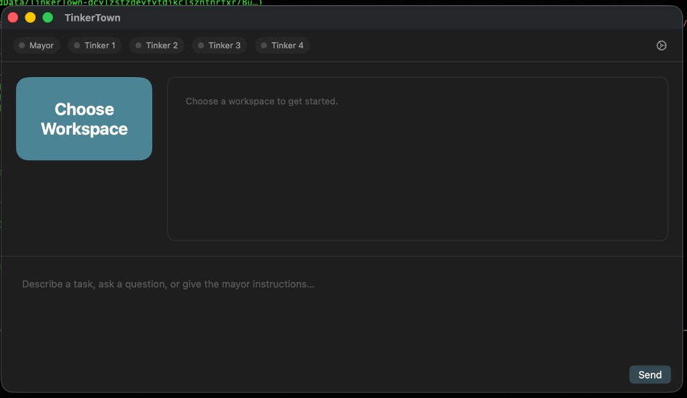

# TinkerTown

TinkerTown is a local-first, autonomous multi-agent coding orchestrator. Inspired by Gas Town, it allows you to submit high-level requests and “fire and forget” while local models (via Ollama) plan, execute, and verify code changes in isolated worktrees. No cloud, no API keys for the default setup. You get a Swift core with a **CLI** and a **macOS app** so you can either live in the terminal or click around. Role model and escalation details are in [OPERATION.md](OPERATION.md).

---

## Demo

**App:** Pick a git repo, type a request, hit Run. The sidebar shows preflight (git, swift, repo, main branch—and ollama if you turned it on), and a list of runs. Select a run to see tasks and state; pick a task to read its logs. Retry failed tasks or cleanup worktrees from the same screen. Escalations get logged with a severity and message.

| Main window | Task list & logs |
|-------------|-------------------|
|  |  |


*Drop `screenshot-main.png` and `screenshot-logs.png` into `docs/` to show the app here. No images yet? The table still describes what you’ll see.*

**CLI:** Same engine, different interface. A **Product Design Requirement (PDR)** is required before any run; use `.tinkertown/pdr.json` or `tinkertown pdr init` to create one, or `--pdr <path>` to use another file.

```bash
swift run tinkertown pdr init --title "My project"   # first time: create PDR
swift run tinkertown run "add a README section for installation"
swift run tinkertown status <run_id>
swift run tinkertown logs <run_id> --task <task_id>
swift run tinkertown retry <run_id> <task_id>
swift run tinkertown cleanup <run_id>
swift run tinkertown escalate --severity HIGH "Dolt: connection timeout"
```

---

## What you need

- **git** – repo has to be a real git repo with a `main` branch.
- **swift** / Xcode CLI tools – to build and run.
- **ollama** (optional) – only if you set `use_ollama: true` in `.tinkertown/config.json`; then it’s used for planning and patch generation. Otherwise you get the built-in (string-split) adapters.

---

## Quick start

**Build & test:**
```bash
swift test
swift build
```

**Mac app (no terminal needed for daily use):**
- Open `Package.swift` in Xcode.
- Choose the **TinkerTownApp** scheme, run.
- Use “Choose…” to pick the repo, type a request, Run. Status, logs, retry, cleanup, and escalate are all in the UI.

**CLI:**
```bash
swift run tinkertown pdr init   # once per repo: create .tinkertown/pdr.json
swift run tinkertown run "<your request>"
# then status, logs, retry, cleanup, escalate as above
```

Config lives in `.tinkertown/config.json`. Runs, events, and task logs end up under `.tinkertown/runs/<run_id>/`; escalations in `.tinkertown/escalations.ndjson`.

That’s it. If something breaks, check [OPERATION.md](OPERATION.md) for the role model and escalation flow.

---

## Why TinkerTown

- **Local-first autonomy**: Once you call `tinkertown run "<request>"`, the Mayor and Tinker agents own planning, execution, verification, and merge decisions end-to-end. The system only interrupts you for high-severity escalations or final reviews, keeping the normal loop “fire and forget.”
- **No data leaves your machine**: All models run via Ollama on your Mac. Source code, prompts, and logs stay local, which is ideal for proprietary apps and internal repositories.
- **Optimized for Qwen 2.5 Coder**: The default configuration assumes Qwen 2.5 Coder models (e.g. `qwen2.5-coder:32b` for Mayor, `qwen2.5-coder:7b` for Tinker) running under Ollama, giving you fast, high-quality coding agents without cloud latency.
- **Apple Silicon aware**: The runtime and default expectations are tuned for modern Apple Silicon machines, where running multiple local models and build jobs in parallel is practical.
